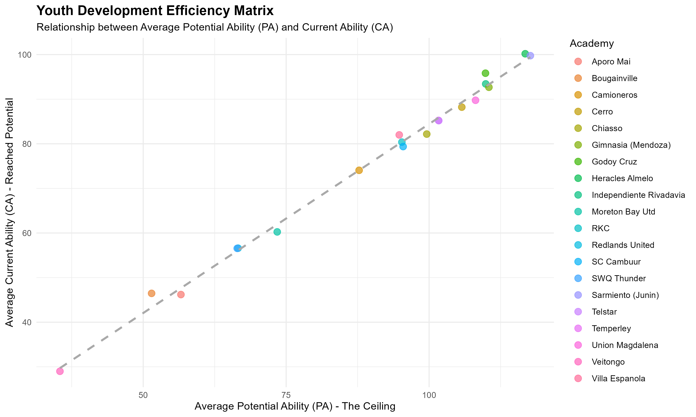

# FM20 Youth Development Analytics

This project explores the "Efficiency Paradox" in Football Manager 2020: Do large academies produce better players, or do smaller ones develop talent more efficiently?

## Project Structure
* **`data/`**: Contains raw datasets (`.csv`) and the cleaned output (`development_efficiency_matrix_clean.csv`).
* **`scripts/`**: Contains the primary analysis pipeline (`analysis.R`).
* **`images/`**: Contains the high-fidelity visualization outputs.
* **`sql/`**: Contains the database extraction logic using SQL Window Functions.

## Key Insights
* **The Efficiency Paradox**: High-production clubs often show lower efficiency percentages as their vast talent pools dilute the average. 
* **Positional Specialization**: Smaller clubs frequently demonstrate superior development efficiency in high-potential prospects compared to global giants.

## Key Visualization

## Data Pipeline & Methods
1. **Data Extraction**: Used SQL Window Functions (`RANK()` over `PARTITION BY`) to rank prospects within their specific academies and positions.
2. **Data Cleaning**: Applied a global encoding fix in R to handle international character sets across academy names.
3. **Visualization**: Used `ggplot2` with `viridis` scales to map development efficiency against current/potential ability metrics.

---
*Developed as a data analytics portfolio project by Ali.*
